# Tactiply

*Your AI marketing strategist — built for real small businesses, not Fortune 500s.*

[](https://tactiply.com)
[](https://reactjs.org/)
[](https://nodejs.org/)
[](https://tailwindcss.com/)
[](https://anthropic.com)
[](https://supabase.com/)

---

## What Is Tactiply?

Tactiply is a full-stack web app that generates a complete, personalized marketing strategy for any small business — in under 60 seconds, powered by Claude AI.

A small business owner answers 5 smart, business-specific questions in a conversational flow, and Tactiply builds them a strategy across 7 professional sections: social media, content calendar, email templates, ad copy, SEO keywords, a marketing score with actionable quick wins, and competitor analysis.

Built for the local salon owner, the freelance photographer, the new gym, the contractor who has no time or budget for a marketing agency — but still needs a real marketing plan.

---

## Live Demo

**[→ Try it at tactiply.com](https://tactiply.com)**

Click **"See a Sample"** on the landing page to explore a full strategy without signing up.

---

## Screenshots

### Landing Page

| Hero | Stats & Feature Overview |
|------|--------------------------|
| 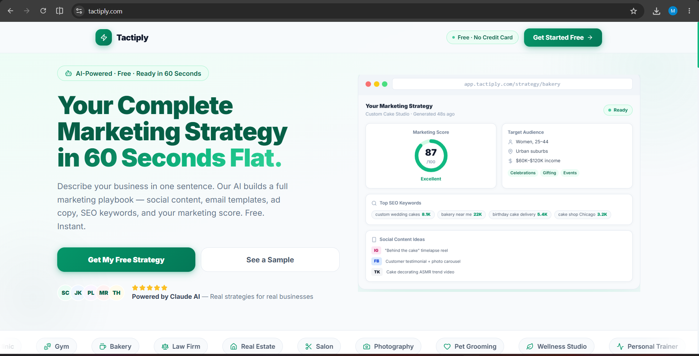 | 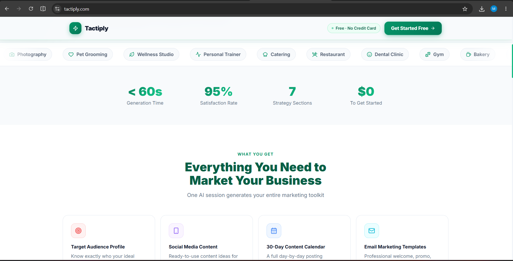 |

| Features Grid | How It Works | Pricing |
|---------------|--------------|---------|
| 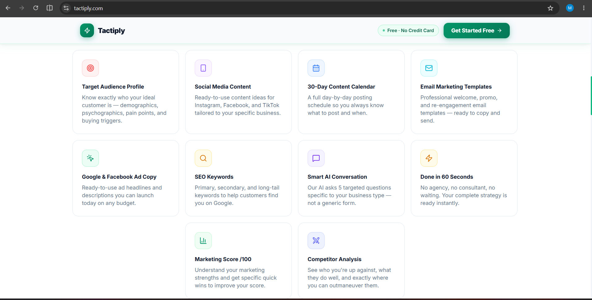 | 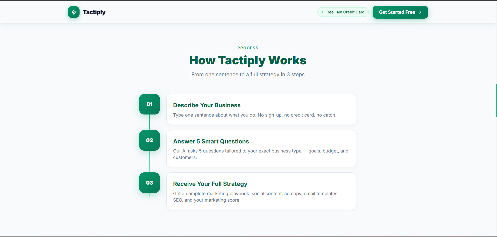 | 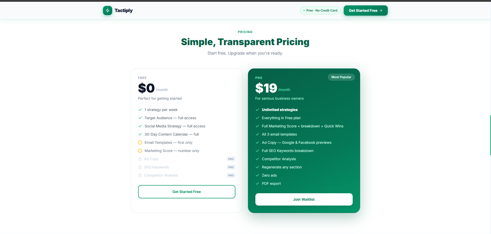 |

| Sample Strategy Cards | Footer |
|-----------------------|--------|
| 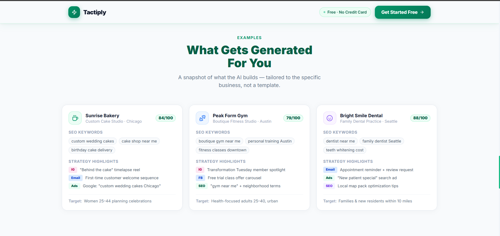 | 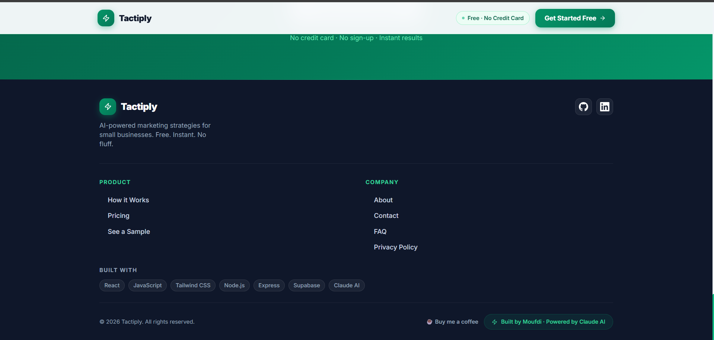 |

---

### Getting Started

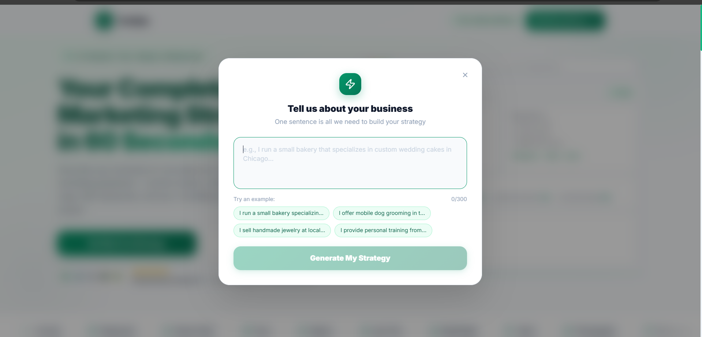

---

### Strategy Results

| Target Audience | Social Media Strategy |
|-----------------|-----------------------|
| 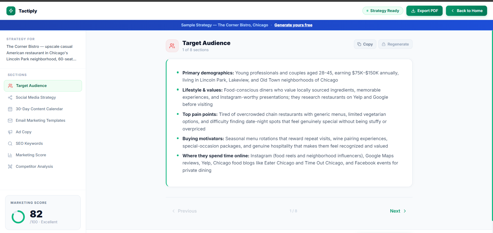 | 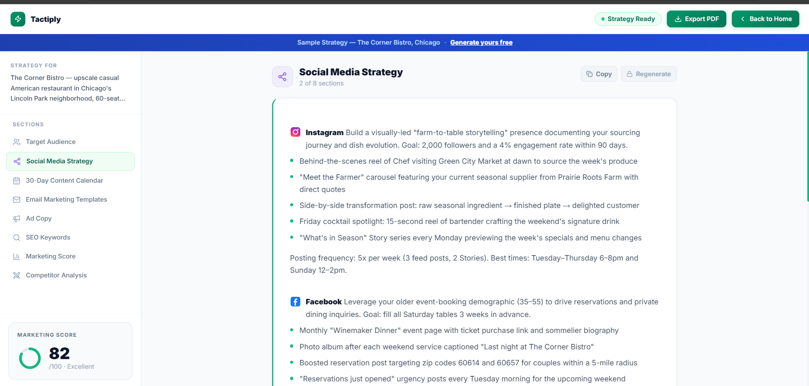 |

| 30-Day Content Calendar | Email Marketing Templates |
|-------------------------|---------------------------|
| 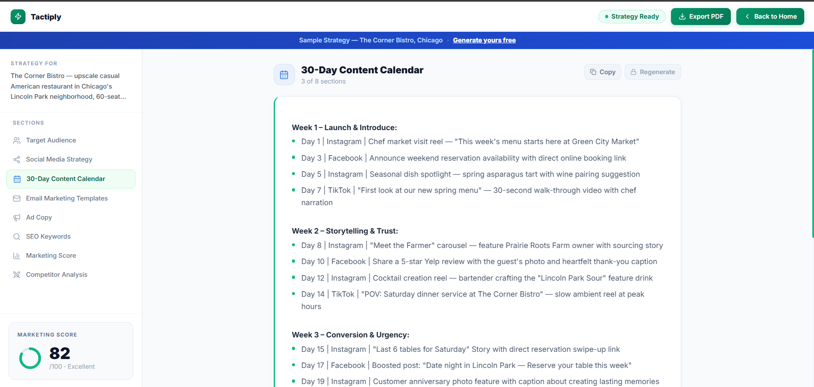 | 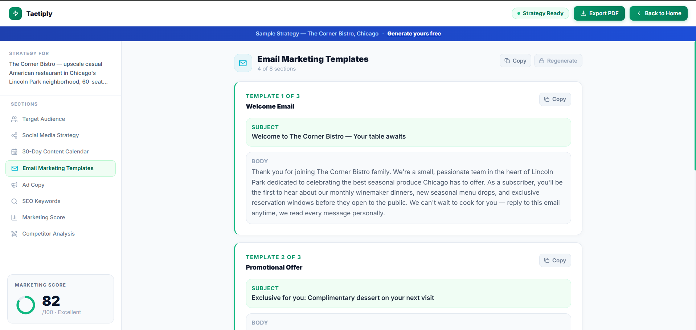 |

| Ad Copy | SEO Keywords |
|---------|--------------|
| 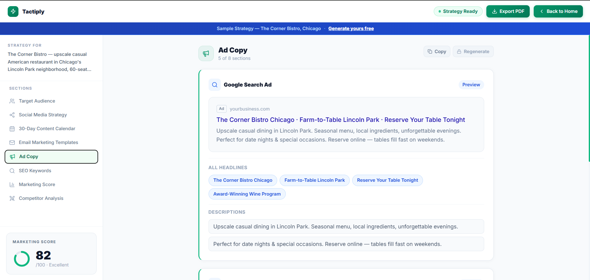 | 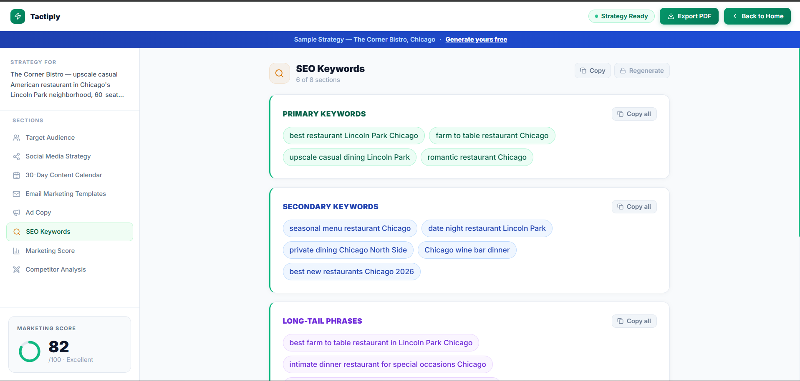 |

| Marketing Score & Quick Wins | Competitor Analysis |
|------------------------------|---------------------|
| 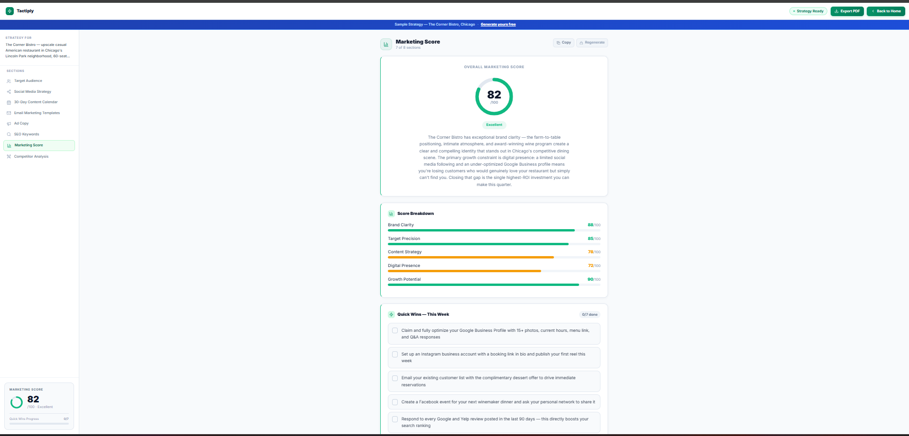 | 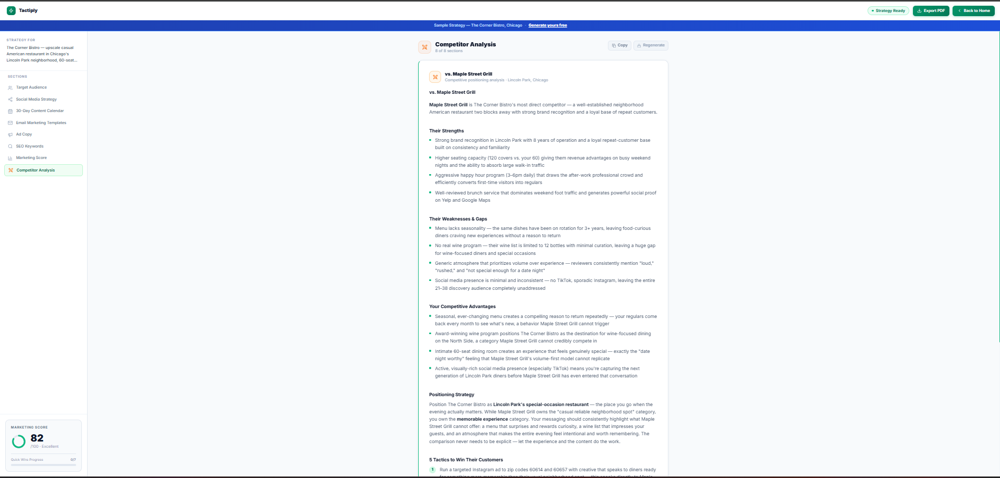 |

---

### Pro Waitlist Modal

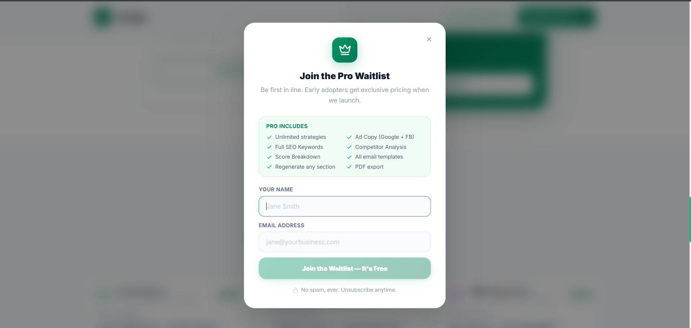

---

### Performance

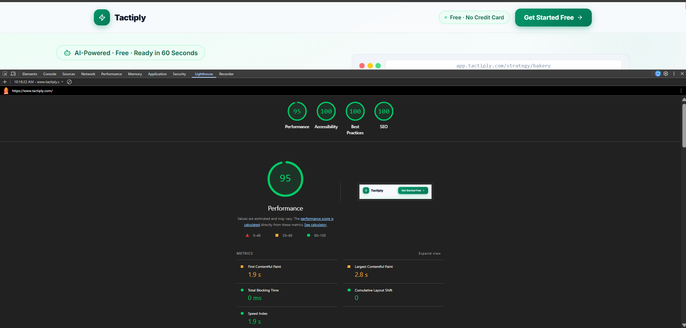

---

## Features

### Intelligent Question Flow
- Claude generates 5 custom questions tailored to your business description — not a generic form
- Conversational UI with typewriter animation and a progress indicator
- Edit any previous answer in place without starting over
- Hints and placeholders on every question to guide better answers

### Real-Time Strategy Streaming
- Strategies stream to the page live using Server-Sent Events (SSE)
- Content appears section by section as the model generates it — no waiting
- Uses `useTransition()` for smooth, non-blocking incremental renders
- Graceful fallback to a blocking request if streaming fails

### 7 Strategy Sections

| # | Section | What's Inside |
|---|---------|---------------|
| 1 | **Target Audience** | Demographics, psychographics, pain points, buying triggers |
| 2 | **Social Media Strategy** | Separate strategies for Instagram, Facebook & TikTok with content ideas |
| 3 | **30-Day Content Calendar** | Week-by-week posting schedule across all platforms |
| 4 | **Email Marketing Templates** | Welcome, Promotional, and Re-engagement email templates |
| 5 | **Ad Copy** | Google Search Ads (headlines + descriptions) + Facebook/Instagram ad copy |
| 6 | **SEO Keywords** | Primary, Secondary, and Long-tail keyword phrases |
| 7 | **Marketing Score** | Score /100 with 5-category breakdown + 7 actionable Quick Wins |

### Competitor Analysis *(Pro)*
- Enter any competitor's name and get a live AI analysis
- Covers: Strengths, Weaknesses & Gaps, Your Advantages, Positioning Strategy, and 5 Tactics to Win

### Section Regeneration *(Pro)*
- Regenerate any individual section without re-running the full strategy

### PDF Export *(Pro)*
- One-click export to a polished PDF — A4 format with cover page, section headers, and page numbers
- Proper markdown → PDF rendering (bold, bullets, tables)
- Filename: `Tactiply-Strategy-[your-business]-[date].pdf`

### Free vs. Pro Plan

| Feature | Free | Pro |
|---------|------|-----|
| Strategies per week | 1 (resets Monday) | Unlimited |
| Target Audience | ✅ Full | ✅ Full |
| Social Media Strategy | ✅ Full | ✅ Full |
| 30-Day Content Calendar | ✅ Full | ✅ Full |
| Email Templates | 1 of 3 | ✅ All 3 |
| Marketing Score | Number only | ✅ Full breakdown + Quick Wins |
| Ad Copy | 🔒 Locked | ✅ Full |
| SEO Keywords | 🔒 Locked | ✅ Full |
| Competitor Analysis | 🔒 Locked | ✅ Unlimited |
| Regenerate Sections | 🔒 Locked | ✅ All sections |
| PDF Export | 🔒 Locked | ✅ Full export |

Pro is planned at **$19/month**. It is not yet live as a paid tier — users currently join a waitlist and will be notified at launch.

### Pro Waitlist via Supabase
- Waitlist modal appears on locked Pro features
- Name + email stored in Supabase PostgreSQL
- Handles duplicate signups gracefully
- Graceful degradation if Supabase is unavailable

### Buy Me a Coffee
- A subtle support card appears after strategy generation (once per session)
- Dismissible, stored in `localStorage` — never shown again after dismissed

### Founder Mode
- Press `Ctrl + Shift + F` anywhere in the app
- Bypasses the weekly free strategy limit for testing and demos
- Session-only — clears when the tab closes, never stored server-side
- Shows a persistent "Founder Mode Active" badge

### UI
- Animated marketing score ring (counts up from 0 to final score)
- Staggered progress bars per score category
- Copy buttons with 2-second "Copied!" confirmation
- Quick Wins checklist with strikethrough animation
- Scroll-triggered reveal animations on the landing page
- Fully responsive, mobile-first design

### Security & Input Validation
- Input sanitization on frontend and backend
- Prompt injection pattern stripping on all user inputs
- 2000 character limit per input field
- Sanitized error responses — no internal stack traces exposed

---

## Tech Stack

**Frontend**
- [React](https://reactjs.org/) + [Vite](https://vitejs.dev/)
- [Tailwind CSS](https://tailwindcss.com/)
- [Lucide React](https://lucide.dev/)
- [jsPDF](https://github.com/parallax/jsPDF) — client-side PDF generation

**Backend**
- [Node.js](https://nodejs.org/) + [Express](https://expressjs.com/)
- [Anthropic Claude API](https://www.anthropic.com/) — `claude-sonnet-4-6` for questions, strategy, competitor analysis, and regeneration
- [Supabase](https://supabase.com/) — PostgreSQL for waitlist email capture

**Infrastructure**
- [Vercel](https://vercel.com/) — frontend hosting
- [Railway](https://railway.app/) — backend Node.js server

---

## Run It Locally

### Prerequisites
- Node.js v18+
- An [Anthropic API key](https://console.anthropic.com/)
- A [Supabase](https://supabase.com/) project with a `waitlist` table

### 1. Clone the repo

```bash
git clone https://github.com/moufdi23/tactiply.git
cd tactiply
```

### 2. Set up the backend

```bash
cd backend
npm install
```

Create a `.env` file in `/backend`:

```env
ANTHROPIC_API_KEY=your_anthropic_api_key_here
SUPABASE_URL=your_supabase_project_url
SUPABASE_ANON_KEY=your_supabase_anon_key
PORT=3001
```

Start the backend server:

```bash
npm start
```

The API will be running at `http://localhost:3001`.

### 3. Set up the frontend

```bash
cd ../frontend
npm install
```

Create a `.env` file in `/frontend`:

```env
VITE_API_URL=http://localhost:3001
VITE_SUPABASE_URL=your_supabase_project_url
VITE_SUPABASE_ANON_KEY=your_supabase_anon_key
```

Start the dev server:

```bash
npm run dev
```

Open [http://localhost:5173](http://localhost:5173) in your browser.

---

## Environment Variables

### Backend (`/backend/.env`)

| Variable | Description |
|----------|-------------|
| `ANTHROPIC_API_KEY` | Your Anthropic API key from [console.anthropic.com](https://console.anthropic.com/) |
| `SUPABASE_URL` | Your Supabase project URL |
| `SUPABASE_ANON_KEY` | Your Supabase anon/public key |
| `PORT` | Port for the Express server (default: `3001`) |

### Frontend (`/frontend/.env`)

| Variable | Description |
|----------|-------------|
| `VITE_API_URL` | URL of your backend server |
| `VITE_SUPABASE_URL` | Your Supabase project URL |
| `VITE_SUPABASE_ANON_KEY` | Your Supabase anon/public key |

---

## Project Structure

```
tactiply/
├── frontend/               # React + Vite app
│   ├── src/
│   │   ├── components/     # UI components (LandingPage, StrategyResults, WaitlistModal, etc.)
│   │   ├── data/           # Sample strategy data
│   │   ├── lib/            # Supabase client
│   │   ├── plan.js         # Free/Pro plan logic + usage tracking
│   │   └── main.jsx        # App entry point
│   └── public/
├── backend/                # Node.js + Express API
│   ├── routes/
│   │   └── api.js          # All API routes
│   ├── services/
│   │   └── claude.js       # Claude API integration + prompts
│   └── server.js           # Express server setup
└── README.md
```

---

## Monetization Model

| Stream | Details |
|--------|---------|
| **Free Tier** | 1 strategy per week — lowers the barrier to entry |
| **Pro Plan** | $19/month (planned) — currently collecting waitlist signups |
| **Buy Me a Coffee** | Optional tip jar for free users who find the tool valuable |

---

## About the Developer

**Built by [Moufdi Ben Saadoune](https://github.com/moufdi23)**

I'm a Full Stack Developer and AI Engineer who built Tactiply from scratch — frontend, backend, AI integration, and deployment — as a real, production-ready product, not just a portfolio piece.
My focus is on building practical applications powered by the Claude API, combining solid full stack fundamentals with hands-on AI integration to create tools that actually solve problems for real users.

**Certifications & Education:**
- Certified Full Stack Web Developer — [4Geeks Academy](https://4geeksacademy.com/)
- AI Fluency: Framework & Foundations — Anthropic Academy
- Claude 101 — Anthropic Academy
- Google Digital Marketing & E-commerce Certificate — Google

I'm open to full stack and AI engineering roles. If you like what you see here, let's connect.

📧 [moufdi.bensaadoune.dev@gmail.com](mailto:moufdibensaadoune1@gmail.com)
🐙 [github.com/moufdi23](https://github.com/moufdi23)

---

## Acknowledgements

- [Anthropic](https://anthropic.com/) — for building Claude and making the API accessible to indie developers
- [Supabase](https://supabase.com/) — for making a real database backend easy to set up
- [Vercel](https://vercel.com/) & [Railway](https://railway.app/) — for making deployment feel like it should
- Every small business owner who tested this and gave feedback ☕

---

<p align="center">
  Made with lots of ☕ by <strong>Moufdi Ben Saadoune</strong>, with the assistance of Claude Code
  <br/>
  <a href="https://tactiply.com">tactiply.com</a> · <a href="https://buymeacoffee.com/tactiply">Buy me a coffee</a>
</p>
